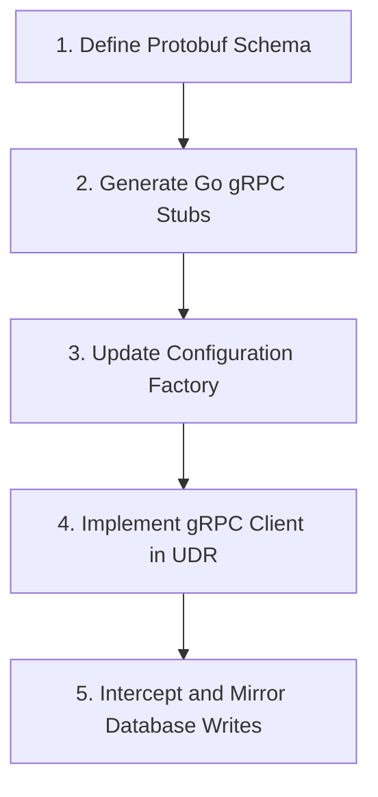

# Architectural Guide: Mirroring UDR Writes to a gRPC Service

This guide provides a comprehensive, step-by-step roadmap to modify the **Unified Data Repository (UDR)** network function in free5GC. The goal is to mirror all state-modifying write operations (creations, updates, and deletions) to an external Rust-based service utilizing **gRPC**.

---

## 1. Conceptual Overview for C/C++ Developers

To bridge the gap between your C/C++ networking background and Go/5G architecture:
1. **gRPC / Protobuf vs. Custom IPC:** Think of gRPC and Protocol Buffers (Protobuf) as a modern, type-safe alternative to RPC generators (like `rpcgen`) or custom binary serialization over TCP sockets. Protobuf defines the message structures and service interface, while gRPC handles the HTTP/2 framing, connection multiplexing, and client/server stub generation.
2. **Go Interfaces vs. C++ Virtual Base Classes:** In Go, interfaces are satisfied implicitly (duck typing). We will define a database wrapper or update the `DbConnector` interface to intercept write calls, similar to using a decorator pattern or overriding a virtual function in C++.
3. **UDR Role:** UDR stores structural 5G subscription data (e.g., SUPI, authentication details, session profiles) and transient session contexts. Other Control Plane NFs write to UDR using HTTP/2 REST APIs (called Service-Based Interfaces or SBI). UDR acts as the backend database controller.

---

## 2. Step-by-Step Implementation Roadmap

Implementing this change involves five main phases:


---

### Step 2.1: Define the Protobuf Schema (`.proto`)
Create a Protocol Buffer file defining the mirror operations. The schema should be flexible enough to handle different collections, query filters, and document payloads.

Create a new directory and file: `NFs/udr/pkg/grpc/proto/udrmirror.proto`.

```protobuf
syntax = "proto3";

package udrmirror;

// Define package path for generated Go code
option go_package = "github.com/free5gc/udr/pkg/grpc/udrmirror";

service UdrMirror {
  // Mirrored write operations (inserts / updates)
  rpc MirrorWrite (WriteRequest) returns (WriteResponse);
  
  // Mirrored delete operations
  rpc MirrorDelete (DeleteRequest) returns (DeleteResponse);
}

message WriteRequest {
  string collection = 1; // Collection or table name (e.g., "subscriptionData.provisionedData.amData")
  string key = 2;        // Primary identifier key (e.g., UE ID / SUPI)
  bytes document = 3;    // JSON/BSON serialized document data
  string operation = 4;  // Type of write: "PUT", "PATCH", "MERGE"
}

message WriteResponse {
  bool success = 1;
  string message = 2;
}

message DeleteRequest {
  string collection = 1;
  string key = 2;
  bytes filter = 3;      // Query filter serialized to BSON/JSON
}

message DeleteResponse {
  bool success = 1;
  string message = 2;
}
```

---

### Step 2.2: Generate Go gRPC Client Stubs
To compile the `.proto` file into Go source files:
1. Ensure `protoc` (Protobuf Compiler) is installed.
2. Install the Go plugins for `protoc`:
   ```bash
   go install google.golang.org/protobuf/cmd/protoc-gen-go@latest
   go install google.golang.org/grpc/cmd/protoc-gen-go-grpc@latest
   ```
3. Run `protoc` from the UDR directory to generate the stubs in `NFs/udr/pkg/grpc/udrmirror/`:
   ```bash
   mkdir -p NFs/udr/pkg/grpc/udrmirror
   protoc --proto_path=NFs/udr/pkg/grpc/proto \
          --go_out=NFs/udr/pkg/grpc/udrmirror --go_opt=paths=source_relative \
          --go-grpc_out=NFs/udr/pkg/grpc/udrmirror --go-grpc_opt=paths=source_relative \
          udrmirror.proto
   ```
   *Note: In your Rust service, you will compile the same `udrmirror.proto` file using Rust crates like `tonic-build` to generate the Rust server-side stubs.*

---

### Step 2.3: Update UDR Configuration Schema
We need to let UDR know where your Rust gRPC service is running and if mirroring is enabled.

1. **Modify Config File:** Update the default configuration in [config/udrcfg.yaml](file:///home/mummadisetty/dfki/free5gc/config/udrcfg.yaml):
   ```yaml
   configuration:
     # ... existing configuration ...
     grpcMirror:
       enabled: true
       address: "127.0.0.1:50051" # Address of your Rust service
       timeout: 5 # Connection timeout in seconds
   ```

2. **Update Go Structs:** Add these configuration fields to the UDR parser. In [NFs/udr/pkg/factory/config.go](file:///home/mummadisetty/dfki/free5gc/NFs/udr/pkg/factory/config.go):
   ```go
   // Under the Configuration struct (line ~69)
   type Configuration struct {
       // ... existing fields ...
       GrpcMirror      *GrpcMirror `yaml:"grpcMirror,omitempty" valid:"optional"`
   }

   type GrpcMirror struct {
       Enabled bool   `yaml:"enabled" valid:"optional"`
       Address string `yaml:"address" valid:"host,required"`
       Timeout int    `yaml:"timeout" valid:"optional"`
   }
   ```

---

### Step 2.4: Implement the gRPC Client in UDR
Implement a connection manager package to handle the channel lifetime, reconnections, and asynchronous writes.

Create a new file [NFs/udr/internal/grpcclient/client.go](file:///home/mummadisetty/dfki/free5gc/NFs/udr/internal/grpcclient/client.go):

```go
package grpcclient

import (
	"context"
	"time"

	"google.golang.org/grpc"
	"google.golang.org/grpc/credentials/insecure"

	"github.com/free5gc/udr/internal/logger"
	"github.com/free5gc/udr/pkg/factory"
	pb "github.com/free5gc/udr/pkg/grpc/udrmirror"
)

type MirrorClient struct {
	conn   *grpc.ClientConn
	client pb.UdrMirrorClient
	config *factory.GrpcMirror
}

var globalMirrorClient *MirrorClient

func InitMirrorClient(cfg *factory.GrpcMirror) {
	if cfg == nil || !cfg.Enabled {
		logger.InitLog.Info("gRPC Write Mirroring is disabled.")
		return
	}

	// equivalent to creating a socket connection with non-blocking dial
	ctx, cancel := context.WithTimeout(context.Background(), time.Duration(cfg.Timeout)*time.Second)
	defer cancel()

	conn, err := grpc.DialContext(ctx, cfg.Address, 
		grpc.WithTransportCredentials(insecure.NewCredentials()),
		grpc.WithBlock(),
	)
	if err != nil {
		logger.InitLog.Errorf("Failed to connect to Rust gRPC Mirror Service: %v", err)
		return
	}

	globalMirrorClient = &MirrorClient{
		conn:   conn,
		client: pb.NewUdrMirrorClient(conn),
		config: cfg,
	}
	logger.InitLog.Infof("Successfully connected to Rust gRPC Mirror Service at %s", cfg.Address)
}

func Close() {
	if globalMirrorClient != nil && globalMirrorClient.conn != nil {
		_ = globalMirrorClient.conn.Close()
	}
}

// MirrorWrite sends insert/update payloads to the Rust service asynchronously or synchronously
func MirrorWrite(collName string, key string, documentBytes []byte, operation string) {
	if globalMirrorClient == nil {
		return
	}

	// Run in a goroutine (equivalent to a lightweight thread or an asynchronous task) 
	// to prevent blocking the UDR HTTP interface
	go func() {
		ctx, cancel := context.WithTimeout(context.Background(), 3*time.Second)
		defer cancel()

		req := &pb.WriteRequest{
			Collection: collName,
			Key:        key,
			Document:   documentBytes,
			Operation:  operation,
		}

		_, err := globalMirrorClient.client.MirrorWrite(ctx, req)
		if err != nil {
			logger.DataRepoLog.Errorf("gRPC write mirroring failed for key %s: %v", key, err)
		}
	}()
}

// MirrorDelete sends delete queries to the Rust service
func MirrorDelete(collName string, key string, filterBytes []byte) {
	if globalMirrorClient == nil {
		return
	}

	go func() {
		ctx, cancel := context.WithTimeout(context.Background(), 3*time.Second)
		defer cancel()

		req := &pb.DeleteRequest{
			Collection:  collName,
			Key:         key,
			Filter:      filterBytes,
		}

		_, err := globalMirrorClient.client.MirrorDelete(ctx, req)
		if err != nil {
			logger.DataRepoLog.Errorf("gRPC delete mirroring failed for key %s: %v", key, err)
		}
	}()
}
```

Add connection startup and teardown to [NFs/udr/pkg/service/init.go](file:///home/mummadisetty/dfki/free5gc/NFs/udr/pkg/service/init.go):
```go
// In Start() function (under SetMongoDB calls)
grpcclient.InitMirrorClient(factory.UdrConfig.Configuration.GrpcMirror)

// In terminateProcedure() function
grpcclient.Close()
```

---

### Step 2.5: Intercept and Mirror Database Writes

UDR writes to MongoDB in two ways:
1. Via the `DbConnector` interface implementations (e.g., `PatchDataToDBAndNotify` in `MongoDbConnector`).
2. Directly calling raw package methods from the imported `github.com/free5gc/util/mongoapi` utility.

You have two architectural options to hook into these writes:

#### Option A: Centralized Database Wrapper (Recommended)
This approach minimizes structural modifications to processors by wrapping database operations inside UDR's own database package.

1. **Expand the `DbConnector` Interface:** Update [NFs/udr/internal/database/database.go](file:///home/mummadisetty/dfki/free5gc/NFs/udr/internal/database/database.go) to include all database operations, eliminating direct calls to `mongoapi` from processors:
   ```go
   type DbConnector interface {
       PatchDataToDBAndNotify(collName string, ueId string, patchItem []models.PatchItem, filter bson.M) (
           map[string]interface{}, map[string]interface{}, error)
       GetDataFromDB(collName string, filter bson.M) (map[string]interface{}, *models.ProblemDetails)
       GetDataFromDBWithArg(collName string, filter bson.M, strength int) (map[string]interface{}, *models.ProblemDetails)
       DeleteDataFromDB(collName string, filter bson.M)
       
       // Add missing write methods
       PutOne(collName string, filter bson.M, putData map[string]interface{}) (bool, error)
       MergePatch(collName string, filter bson.M, patchData map[string]interface{}) error
       JSONPatchExtend(collName string, filter bson.M, patchJSON []byte, targetKey string) error
   }
   ```

2. **Implement Interception in `MongoDbConnector`:** In [NFs/udr/internal/database/mongodb/mongo_db_inplement.go](file:///home/mummadisetty/dfki/free5gc/NFs/udr/internal/database/mongodb/mongo_db_inplement.go), implement the new methods, call the underlying `mongoapi` functions, and call `grpcclient.MirrorWrite` or `grpcclient.MirrorDelete`.
   *Example wrapper logic:*
   ```go
   func (m MongoDbConnector) PutOne(collName string, filter bson.M, putData map[string]interface{}) (bool, error) {
       // 1. Write to MongoDB
       existed, err := mongoapi.RestfulAPIPutOne(collName, filter, putData)
       if err != nil {
           return existed, err
       }

       // 2. Derive key (e.g., "ueId" or "applicationId" value inside filter)
       key := extractKeyFromFilter(filter)

       // 3. Serialize document
       docBytes, _ := json.Marshal(putData)

       // 4. Mirror write to Rust service
       grpcclient.MirrorWrite(collName, key, docBytes, "PUT")

       return existed, nil
   }
   ```

3. **Refactor Processor Calls:** Refactor calls in SBI processors (e.g., `CreateAmfContext3gppProcedure` in [NFs/udr/internal/sbi/processor/amf3_gpp_access_registration_document.go](file:///home/mummadisetty/dfki/free5gc/NFs/udr/internal/sbi/processor/amf3_gpp_access_registration_document.go)) to call your `Processor.DbConnector` rather than the static `mongoapi` functions:
   ```diff
   - if _, err := mongoapi.RestfulAPIPutOne(collName, filter, putData); err != nil {
   + if _, err := p.PutOne(collName, filter, putData); err != nil {
   ```

#### Option B: Proxy Wrapper Package (Saves Refactoring Time)
If you wish to avoid changing all calls inside 40+ processor files:
1. Create a local package inside UDR (e.g., `github.com/free5gc/udr/internal/database/mongoapi`) that mirrors the functions of the external `github.com/free5gc/util/mongoapi`.
2. Inside each method of your local wrapper, execute the real `mongoapi` function and call the gRPC client routines.
3. Update imports inside the processor files to import `github.com/free5gc/udr/internal/database/mongoapi` instead of `github.com/free5gc/util/mongoapi`.

---

## 3. Reference Glossary & Jargon Summary
*   **SBI (Service-Based Interface):** The HTTP/2 and JSON REST APIs used for control plane signaling between NFs in a 3GPP 5G core.
*   **SUPI (Subscription Permanent Identifier):** The unique identity of the subscriber (contains IMSI/MCC/MNC properties).
*   **JSON Patch / Merge Patch:** Standardized methods (`RFC 6902` / `RFC 7386`) of sending delta updates to a JSON document instead of uploading the full document.
*   **UDR (Unified Data Repository):** The centralized database network function, which acts as the persistent store. UDR is completely stateless regarding application execution logic.
