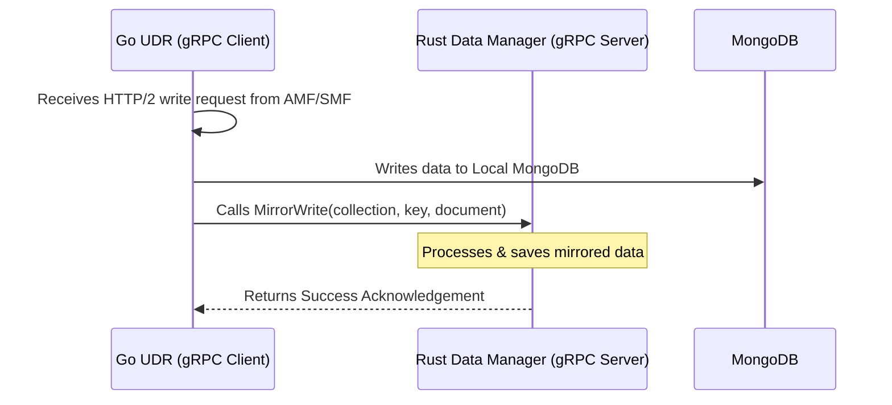

# Beginner's Guide: Connecting free5GC UDR and a Rust gRPC Data Manager

This guide walks you through connecting the Go-based **UDR (Unified Data Repository)** in free5GC to your custom **Rust-based Data Manager** using gRPC. This allows UDR to mirror all subscriber and session data updates to your Rust service.

---

## 1. How gRPC Connects the Two Services

In this setup, the two services communicate over a network socket using a **Client-Server** model:



- **Rust Data Manager (Server):** Listens on a specific network port (e.g., `127.0.0.1:50051`) waiting for incoming database updates.
- **Go UDR (Client):** Establishes a TCP connection to the Rust server's port and sends structured messages whenever a database update occurs.

---

## 2. Step 1: Rust Server Setup (Tonic)

To enable your Rust service to receive gRPC calls from Go:

### A. Configure `Cargo.toml`
Add the standard Rust crates for gRPC (`tonic` and `prost`) and the asynchronous runtime (`tokio`) to your Rust project's `Cargo.toml`:

```toml
[dependencies]
tonic = "0.10"
prost = "0.12"
tokio = { version = "1.0", features = ["full"] }

[build-dependencies]
tonic-build = "0.10"
```

### B. Create a Build Script (`build.rs`)
In the root directory of your Rust project, create `build.rs`. This script automatically compiles the `.proto` schema file into Rust structures whenever you run `cargo build`:

```rust
fn main() -> Result<(), Box<dyn std::error::Error>> {
    // Compiles the shared udrmirror.proto schema
    tonic_build::compile_protos("proto/udrmirror.proto")?;
    Ok(())
}
```
*Note: Copy the `udrmirror.proto` file into a `proto/` directory in your Rust project.*

### C. Implement the Server (`src/main.rs`)
Here is a template to receive the write and delete notifications from Go:

```rust
use tonic::{transport::Server, Request, Response, Status};

// Import the auto-generated code from the proto file
pub mod udrmirror {
    tonic::include_proto!("udrmirror");
}

use udrmirror::udr_mirror_server::{UdrMirror, UdrMirrorServer};
use udrmirror::{WriteRequest, WriteResponse, DeleteRequest, DeleteResponse};

#[derive(Debug, Default)]
pub struct MyUdrMirror {}

#[tonic::async_trait]
impl UdrMirror for MyUdrMirror {
    // Triggered when UDR inserts or updates a document
    async fn mirror_write(
        &self,
        request: Request<WriteRequest>,
    ) -> Result<Response<WriteResponse>, Status> {
        let req = request.into_inner();
        
        println!("Received Write Notification!");
        println!("  Collection: {}", req.collection);
        println!("  Key: {}", req.key);
        println!("  Operation: {}", req.operation);
        
        // Convert raw bytes payload back into a string or parse BSON/JSON
        if let Ok(json_str) = std::str::from_utf8(&req.document) {
            println!("  Document Payload: {}", json_str);
        }

        // TODO: Save this data to your Rust-managed database here

        let response = WriteResponse {
            success: true,
            message: "Mirrored successfully inside Rust".to_string(),
        };
        Ok(Response::new(response))
    }

    // Triggered when UDR deletes a document
    async fn mirror_delete(
        &self,
        request: Request<DeleteRequest>,
    ) -> Result<Response<DeleteResponse>, Status> {
        let req = request.into_inner();
        println!("Received Delete Notification for Collection: {}, Key: {}", req.collection, req.key);

        let response = DeleteResponse {
            success: true,
            message: "Deleted successfully inside Rust".to_string(),
        };
        Ok(Response::new(response))
    }
}

#[tokio::main]
async fn main() -> Result<(), Box<dyn std::error::Error>> {
    let addr = "[::1]:50051".parse()?;
    let mirror_service = MyUdrMirror::default();

    println!("Rust gRPC Server listening on {}", addr);

    Server::builder()
        .add_service(UdrMirrorServer::new(mirror_service))
        .serve(addr)
        .await?;

    Ok(())
}
```

---

## 3. Step 2: Go Client Setup (UDR)

In UDR, the client needs to connect to the Rust server using the generated stubs.

### A. Establish the Connection
Implement the client connection code in [NFs/udr/internal/grpcclient/client.go](file:///home/mummadisetty/dfki/free5gc/NFs/udr/internal/grpcclient/client.go).
- `grpc.DialContext` acts like the standard socket `connect()` system call, but handles negotiations under the hood.
- We use `grpc.WithTransportCredentials(insecure.NewCredentials())` because we are running both services locally without TLS certificates (plaintext communication).

### B. Trigger Mirroring on Database Writes
Inside UDR's database connector (e.g., [NFs/udr/internal/database/mongodb/mongo_db_inplement.go](file:///home/mummadisetty/dfki/free5gc/NFs/udr/internal/database/mongodb/mongo_db_inplement.go)), after a database write returns successfully, construct the payload:
```go
// 1. Serialize the Go data structure into a JSON byte array
documentBytes, err := json.Marshal(putData)

// 2. Transmit the data to the Rust service via gRPC
grpcclient.MirrorWrite(collName, key, documentBytes, "PUT")
```

---

## 4. Step 3: Run and Verify the Connection

Follow this sequence to run and verify the configuration:

1. **Start the Rust Data Manager:**
   Run the Rust project:
   ```bash
   cargo run
   ```
   It will print: `Rust gRPC Server listening on [::1]:50051`.

2. **Configure UDR Target:**
   Ensure UDR points to the Rust server in [config/udrcfg.yaml](file:///home/mummadisetty/dfki/free5gc/config/udrcfg.yaml):
   ```yaml
   configuration:
     grpcMirror:
       enabled: true
       address: "localhost:50051"
   ```

3. **Start free5GC UDR:**
   Build and start UDR:
   ```bash
   make udr
   ./bin/udr
   ```

4. **Verify the logs:**
   When an AMF or SMF sends data to UDR (for example, registering a device during subscriber tests), UDR writes to its local MongoDB database and simultaneously sends a gRPC request. Look at your Rust console; you will see the incoming write notifications and JSON payload output.
